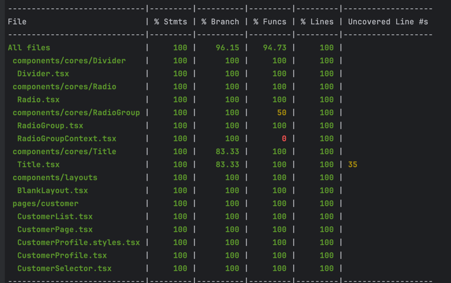

# Code challenge for Frontend Developer

## Project Overview

This project is part of a coding challenge to build a React application that fetches and displays customer data using
GraphQL. The application includes a customer list with filtering capabilities based on user roles, styled using
styled-components.


## Installation

To install and set up the project, follow these steps:

1. Install the dependencies:

```bash
npm install
```

2. Generate the GraphQL types:

```bash
npm run compile
```

3. Start the development server:

```bash
npm start
```

This will start the application on http://localhost:3000.

## Test Coverage



## Decisions and Trade-offs

### Component API Design

I have extracted many reusable components under components/core. In real projects, these would typically be replaced by
a design system or a component library. When extracting these components, apart from adhering to a11y standards,
designing the API is an important consideration. The design of the API requires a trade-off between flexibility and
consistency.

For example, my Radio component's props interface RadioProps extends Omit<InputHTMLAttributes<HTMLLabelElement>, '
onChange'>, providing great flexibility:

```tsx
interface RadioProps extends Omit<InputHTMLAttributes<HTMLLabelElement>, 'onChange'> {
  value?: string;
  defaultChecked?: boolean;
  disabled?: boolean;
  onChange?: (event: ChangeEvent<HTMLInputElement>) => void;
  checked?: boolean;
}
```

This design is common in public component libraries (like MUI) because the library designers do not know how users will
use their components. However, for a mature design system, this kind of API design can lead to unpredictable outcomes,
weakening consistency. In this scenario, a strict and opinionated API is often better. For example, my Radio Group
component's props are defined as follows:

```tsx
interface RadioGroupProps {
  value: string;
  onChange: (event: React.ChangeEvent<HTMLInputElement>) => void;
  disabled?: boolean;
  buttonStyle?: 'outline' | 'solid';
  optionType?: 'default' | 'button';
  size?: 'large' | 'middle' | 'small';
  children: ReactNode;
}
```

(Some props are not yet implemented and are just for demonstrating the API design.)

The more mature a design system is, the more confident it might be in using a stricter API. However, in the early stages
of design, retaining flexibility can also be a good choice.

### Using Suspense with Apollo

Regarding the use of Suspense, Apollo's useSuspenseQuery can be effectively paired with Suspense to separate loading
logic from business logic. This approach aligns with the clean code principle of separating cross-cutting concerns,
similar to how error boundaries work.

In server components, Suspense can offer even more advantages. However, engineers should be cautious of potential issues
when adopting new technologies. For instance, useSuspenseQuery suspends while data is being fetched, which can cause a "
waterfall" effect if multiple components in a tree use it. Each query may depend on the previous one to complete before
it starts fetching. Luckily, This can be mitigated by fetching data with useBackgroundQuery and reading it with useReadQuery.

## Things to Improve
1. Too many magic strings in CSS
2. msw can be a better way for testing
